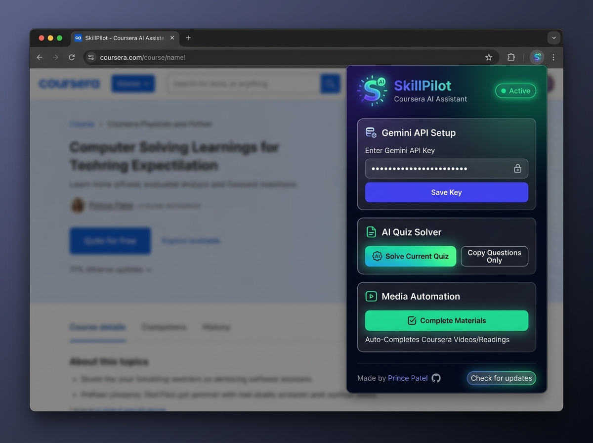

> [!CAUTION]
> ### ⚠️ Disclaimer: For Educational Purposes Only
> This extension was created strictly for **educational and learning purposes** to explore browser extension development, DOM manipulation, and API interception. 
> 
> * **No Liability:** The creator of this extension is not responsible for any consequences that may arise from using this tool.
> * **Academic Integrity:** Coursera has strict policies regarding academic integrity. Using this tool to automatically complete courses or solve quizzes may violate Coursera's Terms of Service and Honor Code.
> By using this open-source software, you agree that you are taking full responsibility for your own actions.

# SkillPilot - Coursera Auto Solver 🎓

  
  
<em>Speedrun your courses smoothly & efficiently</em>

A sleek, lightweight Chrome Extension powered by AI to automate and help you navigate your Coursera courses with ease. 

## ✨ Features

* **⚡ Media Auto-Completer:** Instantly mark all videos, readings, and supplements as complete in the background. No API key or setup required!
* **📋 Question Extractor:** Neatly extracts all quiz and assignment questions from the page into a clean format so you can easily copy them. No API key needed!
* **🤖 Smart Quiz Solver:** Automatically solves multiple choice and text-input quizzes silently and instantly using a Google Gemini AI key.

## 🚀 How to Use

### 1. Install the Extension
1. Clone or download this repository (`git clone https://github.com/Prince94-p/SkillPilot.git`).
2. Open Google Chrome and navigate to `chrome://extensions/`.
3. Enable **Developer mode** (toggle in the top right corner).
4. Click **Load unpacked** and select the folder containing this extension's files.

### 2. Configure and Run 
1. Navigate to any Coursera course page inside the `/learn/` path.
2. Click the **SkillPilot** icon in your Chrome toolbar.
3. Automatically mark all videos as complete by clicking **Complete Materials**, or extract questions by clicking **Copy Questions Only**.
4. To automatically solve quizzes directly within your browser, get a free Google Gemini API key from [Google AI Studio](https://ai.google.dev/aistudio), paste it into the UI, click **Save**, and then click **Solve Current Quiz**.

***

Made by [Prince Patel](https://github.com/Prince94-p) | Repository: [SkillPilot](https://github.com/Prince94-p/SkillPilot)